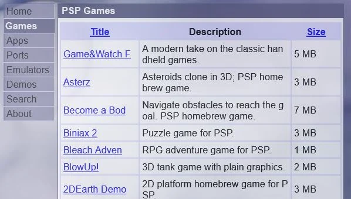
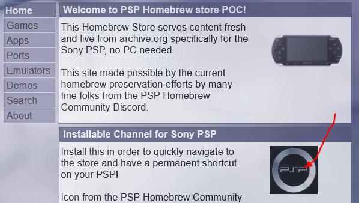
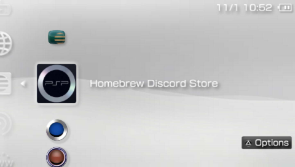
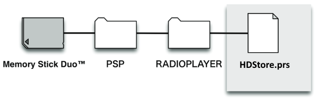

# Adding the Homebrew Discord Store to your PSP

## Internet access

As the PlayStation Portable does not support WPA2, getting it to connect to the internet can prove troublesome.

Many modern routers do offer support for less secure standards (such as WPA) for backward compatibility. Every router will have different ways to set this up, but generally this is done by establishing a secondary Wi-Fi configuration. 

As this second Wi-Fi network will have lower security, it is advisable to:

1. turn off SSID broadcast for the WPA connection,
1. filter the list of devices allowed to connect by MAC address. You will find the MAC address of your PSP by going to Settings -> System Settings -> System Information.

Alternatively, owners of an Android device may set up a mobile hotspot with lower security settings. This is not possible on iOS devices.

## Automatic setup from PSP Browser

Once your PSP can access the internet, visit `http://psp-dev.org/hb/` from your PSP broswer, and then click on the icon under 'Installable Channel for Sony PSP': 

Having completed the installation, you will find the store icon under Network -> Internet Radio -> Homebrew Discord Store.

## Manual installation from Memory Stick

After connecting your PSP to your computer, download (https://archive.org/download/pic_0001/HDStore.prs)[HDStore.prs], place it under the PSP/RADIOPLAYER folder, and launch it from the Network menu.

