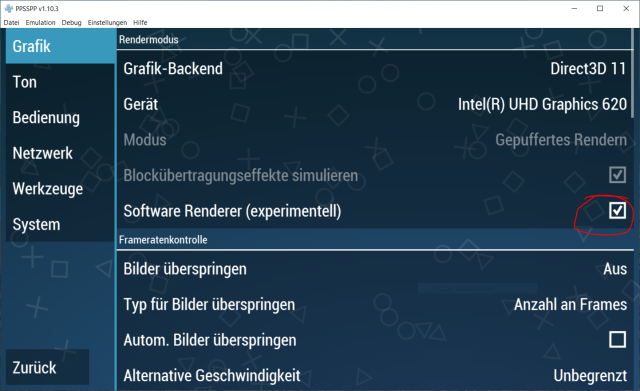

# PSP Homebrew Library - Help Page

Loading a homebrew game on your PSP will require that you first install a custom firmware. All PSP models ever released can now run custom firmware, and therefore, homebrew games. There are countless guides and YouTube videos available with detailed explanation on how to install custom firmwares, in case you do not have one on your device already.

## Basics

Extract the archives with [7-Zip](https://www.7-zip.org/) and place them in your Memory Stick under `PSP\GAME` (unless the readme states otherwise).

## Will they work?

Homebrew games are wonderful for many reasons - individuals are willing to put in hours of work on their creation - allowing us to enjoy them - while expecting no compensation at all.

One thing they don't shine for, however, is quality control. Most of them were last updated a decade ago, if not more. The passage of time may have made them unplayable on modern firmware. While efforts are made to test games and apps before they are uploaded, expect that at least some will not work properly.

Where the source code is still available, attempts can be made to get the games to work again. If the source code is lost, or was never published, there is little to be done.

Some apps will not work because they depend on a service that is no longer active (e.g. a client for the now defunct MSN Messenger service). In this case the app is not considered broken - it has served its purpose, and will be retained in the Library for its historic value.

### PSP-1000 (or 'PHAT' models)

The PSP-1000 (the first one to be released) is the only PSP model to have only 32Mb of memory. Some homebrew developers choose to not support this version for their release, to take full advantage of the extra memory available in later models. Such released are tagged with 'PSP-2000+ only' within the PSP Homebrew Library.

### PlayStation Vita

Most homebrews created for PSP should be able to run on a PS Vita through the Adrenaline app. Some homebrews (emulators especially) make use of the Media Engine chip, which is not found on the PS Vita. In this case, the homebrew  will not be able to work.

### PPSSPP emulation

Ticking the Software Rendering box in the Graphics settings of PPSSPP may get rid of glitches in some games. It will also decrease performance, however.

## A note on Authorship

The 'creator' field on the Internet Archive pages reflects the credits listed either within the archived homebrew itself, or the readme file provided with a given build. We make no claims on their accuracy, nor do we seek to establish an absolute truth on the authorship of a project. We have no means to adjudicate authorship disputes. The 'creator' field is merely a convenient way of cataloguing projects as they are preserved. 

## Reporting non-working Homebrews

To report a broken homebrew, create a new entry in our [Issues page](https://github.com/PSP-Archive/docs/issues). Make sure to specify the PSP model and the firmware version that you are using.
